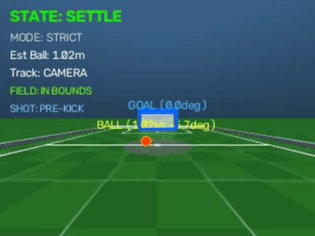
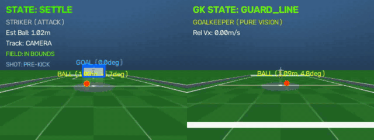
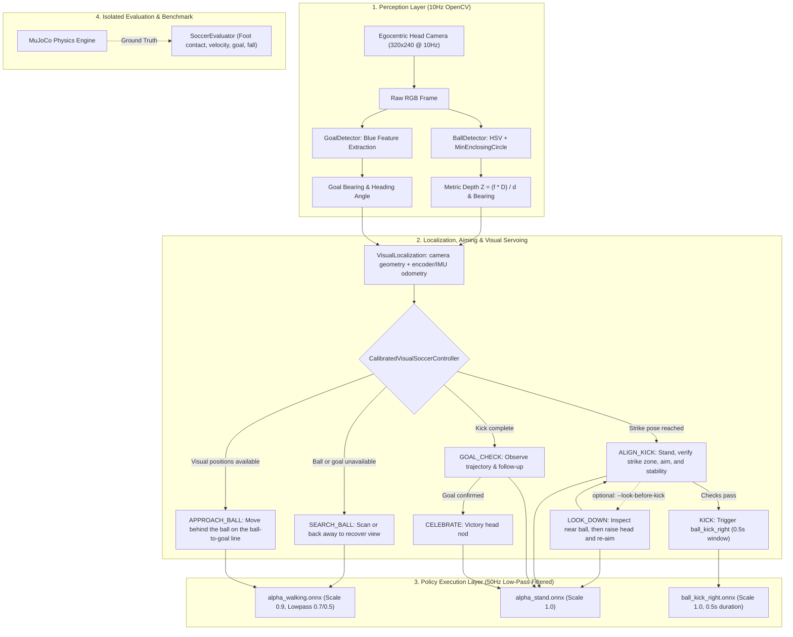

# 🦆 Microduck Vision Soccer ⚽

Vision-driven autonomous soccer for Pollen Microduck: find the ball with the head camera, approach and aim, then score with a physical bipedal kick in MuJoCo. The latest simulation supports a visual striker versus a monocular visual goalkeeper.

<p align="center">
  <a href="README.md"><b>English</b></a> · <a href="README_zh.md"><b>中文</b></a>
</p>

<p align="center">
  
  <br><sub>Strict visual striker: detect → approach → aim → physical kick → goal</sub>
</p>

<p align="center">
  <b>98/100 goals · 96/100 goals with kick contact · 0 falls</b><br>
  <sub>Frozen MuJoCo ground-truth navigation baseline, seeds 100–199. The GIF above runs the camera-driven controller. Results are intentionally reported separately.</sub>
</p>

```bash
pip install -r requirements.txt
python sim_duck_soccer.py --mode strict
python benchmark.py --trials 10 --seed 0
```

The strict controller uses RGB head-camera frames plus IMU and joint encoders; simulator world positions are reserved for evaluation. Kicks come from the bundled ONNX policy and actual MuJoCo contact—no ball teleportation or injected velocity. The real Microduck hardware has not shipped yet, so real-robot behavior has not been verified; the onboard runner is included for future hardware testing.

<p align="center">
  
  
  
  
  
</p>

> **Status: simulation prototype.** See [VALIDATION.md](VALIDATION.md) for the strict visual controller's scope and [ORACLE_VALIDATION.md](ORACLE_VALIDATION.md) for the separately validated 98/100 ground-truth baseline.

### Latest: visual 1v1 striker vs goalkeeper

<p align="center">
  
  <br><sub>Dual onboard-camera HUD: the striker kicks at 8.44 s; the goalkeeper sees, intercepts, and clears the physical ball.</sub>
</p>

```bash
python sim_duck_soccer.py --mode strict --goalkeeper
```


---

## 📖 Motivation & Technical Positioning

In the official [Pollen Robotics Microduck](https://github.com/pollen-robotics/microduck) reinforcement learning stack, the pre-trained `ball_kick_right.onnx` policy is intentionally **ball-blind**: it executes a dynamic kicking motion from a standing stance, assuming an operator or high-level behavior has already navigated the robot to the ball. Furthermore, official architecture documents designate ball play (`approach / line up / kick`) as a planned perception-driven autonomous behavior.

While projects like `quackd` (2D simulator) and recent community edge implementations (e.g. RDK X5) explore ball tracking, **Microduck Soccer** provides a clean, simulator-first, strict visual servoing layer designed directly against the official Microduck MJCF models, sensor conventions, and `robotd` runtime:

- **100% Strict Vision (`--mode strict`)**: The controller relies strictly on RGB head camera frames and robot proprioception (IMU, joint encoders). Ball world position and velocity are reserved for evaluation; joint velocity and IMU observations still feed the low-level policy.
- **Physical Dynamic Kick (No Teleportation)**: Attempts to navigate into the right-foot strike zone. No artificial ball teleportation or snapping.
- **Monocular Metric Depth Estimation**: Solves metric distance from known ball diameter ($D = 70\text{ mm}$) using pinhole geometry:
  $$Z \approx \frac{f \cdot D}{d}$$
- **Official `robotd` Control Chain Alignment**: Implements official action scaling ($0.9$ walk, $1.0$ kick/stand), first-order joint low-pass filters (legs $\alpha=0.7$, head $\alpha=0.5$), and official 0.5s kick duration windows.
- **Onboard RPC Protocol Compliance**: Real-robot script (`duck_soccer_onboard.py`) uses the `duck-ipc-proto` request shape (hardware unverified): continuous `robot.move` notifications with `vyaw` (not `vtheta`), discrete `robot.do` requests, and official `chirp` voice tags.

---

## 🏗️ System Architecture



---

## 🎯 State Machine Specification

The default strict controller converts ball and goal pixels into local metric estimates, then carries those estimates through the near-field camera blind spot with short-range joint-encoder/IMU odometry. It positions the right foot on a calibrated strike pose and actively aims the measured ball-to-goal line. An optional look-down pass can visually reconfirm a stationary near ball before the kick:

| State | Perception Trigger | Control Action | Transition Condition |
| :--- | :--- | :--- | :--- |
| **`SEARCH_BALL`** | Ball or goal estimate is unavailable/stale | Scan in place; back away when a remembered ball is too close to see | Fresh ball and goal estimates available |
| **`APPROACH_BALL`** | Camera-derived ball/goal positions plus encoder/IMU odometry | Stage behind the ball, move to the calibrated right-foot strike pose, and align the predicted kick direction with the goal | Target pose reached or predicted foot clearance is closing |
| **`ALIGN_KICK`** | Strike pose reached | Stand in `alpha_stand`; verify ball zone, shot margin, body stability, and ball speed | All kick checks pass |
| **`LOOK_DOWN`** *(optional)* | `--look-before-kick` and kick checks pass | Lower the head, collect consistent near-ball image samples, raise the head, then re-run positioning and aim checks | Ball reconfirmed, or inspection times out without kicking |
| **`KICK`** | Strike-zone, aim, stability, and ball-speed checks pass | Swap ONNX policy to `ball_kick_right.onnx` for dynamic single-leg strike | Kick duration expires ($0.5\text{ s}$) |
| **`GOAL_CHECK`** | Kick finished | Stand upright and observe ball trajectory | Strict mode returns to `SEARCH_BALL` after waiting; goal truth is evaluation-only |
| **`CELEBRATE`** | Demo-only evaluator goal signal | Pitch head up and down rhythmically, victory celebration | Timer expires |

---

## 🚀 Simulation Quickstart

### 1. Installation
```bash
git clone https://github.com/toyhank/microduck-vision-soccer.git
cd microduck-vision-soccer
pip install -r requirements.txt
```

### 2. Run the 3D Soccer Simulation (Strict Vision Mode)
```bash
# Strict mode: 100% vision, physical contact kicking, no cheating
python sim_duck_soccer.py --mode strict

# 1-on-1 Match Mode: Pure Monocular Vision Goalkeeper (Emerald Green, 10Hz camera + trajectory intercept, dual HUD)
python sim_duck_soccer.py --mode strict --goalkeeper

# Record 1v1 HD dual-vision match video to MP4 (1280x480)
python sim_duck_soccer.py --mode strict --goalkeeper --record match.mp4 --duration 12

# Goalkeeper ground-truth baseline comparison (Oracle Mode)
python sim_duck_soccer.py --mode strict --goalkeeper --gk-mode oracle

# Optional: headless high-speed run with bounded duration
python sim_duck_soccer.py --headless --duration 12

# Demo mode (for visual testing with oracle assistance)
python sim_duck_soccer.py --mode demo
```

### 3. Run the Automated Benchmark Suite
Run randomized trials (random ball distance, random initial yaw) to compute quantitative success metrics:
```bash
python benchmark.py --trials 10
```

Save reproducible per-trial results:
```bash
python benchmark.py --trials 10 --seed 0 --output results.json
python -m unittest discover -s tests -v
```
`kick_contact` requires physical right-foot/ball contact during the kick policy. `foot_contact` also includes walking contacts. Proximity and velocity alone do not count. Entering terminal approach does not prove that the ball reached the strike zone.


---

## Ground-truth navigation baseline (simulation only)

`oracle_soccer.py` uses simulated robot/ball positions, ball velocity and foot clearance to navigate behind the ball, settle and aim the existing right-foot kick policy. Robot and ball states are initialized once; subsequent motion comes from joint control and MuJoCo contacts. It does not use a camera and cannot be deployed directly on hardware.

```bash
python oracle_soccer.py --viewer --seed 100
# No renderer needed for batch trials:
python oracle_soccer.py --seed 100 --trials 100 --duration 40 --workers 4 --output oracle-results.json
```

Frozen-controller validation on seeds 100–199: **98/100 goals, 96/100 goals with kick contact, 0/100 falls**. Two goals were walking pushes without kick contact. These results cover a narrow initial-position range and do not describe strict visual performance. See [ORACLE_VALIDATION.md](ORACLE_VALIDATION.md) and [per-trial data](validation/oracle-seeds-100-199.json).

## 🤖 Real-Robot Onboard Deployment

The script [`duck_soccer_onboard.py`](duck_soccer_onboard.py) runs directly on the Microduck's onboard Rockchip RK3566 Linux SBC:

### 1. Protocol Architecture
- **Camera**: Captures from `/dev/video0` via OpenCV.
- **Local IPC Socket**: Connects directly to `/run/robotd.sock` over JSON-RPC 2.0.
  - Continuous velocity control: `notify("robot.move", {"vx": 0.3, "vy": 0.0, "vyaw": ...})`
  - Discrete skill triggering: `request("robot.do", {"skill": "kick_right"})`
  - Voice feedback: `notify("robot.sound", {"tag": "chirp"})`

### 2. Deployment Steps
```bash
# 1. Copy script to the robot
scp -r duck_soccer_onboard.py microduck_soccer radxa@<DUCK_IP>:~/

# 2. Run on the robot
ssh radxa@<DUCK_IP>
python3 duck_soccer_onboard.py
```

---

## 📂 Repository Structure

```text
microduck-vision-soccer/
├── sim_duck_soccer.py        # ⚽ Simulation entry point (--mode strict / demo)
├── benchmark.py              # 🏁 Automated benchmark suite
├── duck_soccer_onboard.py    # 🤖 Compliant real-robot onboard runner
├── oracle_soccer.py          # 🎯 Ground-truth navigation baseline
├── requirements.txt          # 📦 Python dependencies
├── LICENSE                   # 📄 Apache-2.0 License
├── NOTICE                    # 📄 Attribution & upstream notices
├── README.md                 # 📖 English documentation
├── README_zh.md              # 📖 Chinese documentation
│
├── assets/                   # 🏟️ Decoupled self-contained simulation assets
│   ├── scene_soccer.xml      # MuJoCo soccer pitch scene (single striker)
│   ├── scene_soccer_goalkeeper.xml # Dual-duck match scene (striker + goalkeeper)
│   ├── robot_allcollisions.xml # Striker robot kinematics & collision definitions
│   ├── robot_goalkeeper.xml  # Goalkeeper robot (Emerald Green Jersey)
│   ├── meshes/               # 94 STL & part mesh assets
│   └── policies/             # Standalone ONNX policies (walking, kicks, stand)
│
├── microduck_soccer/         # 📦 Core autonomous soccer package
│   ├── assets.py             # Centralized asset loader & path resolution
│   ├── perception/           # Monocular depth and goal detection
│   ├── control/              # Visual servoing, strict FSM & goalkeeper controller
│   ├── policy/               # Official robotd-aligned ONNX runner
│   └── evaluation/           # Isolated metric evaluator (goals & saves)
│
├── tests/                    # 🧪 Unit test regression suite
└── validation/               # 📊 Validation benchmark data & reports
```

---

## 🤝 Acknowledgments & Prior Work

- Builds upon the [Microduck](https://github.com/pollen-robotics/microduck) bipedal platform by **Pollen Robotics / Hugging Face**.
- Context and inspiration from community works including `quackd` and D-Robotics RDK X5.
- Powered by [DeepMind MuJoCo](https://mujoco.org/).
