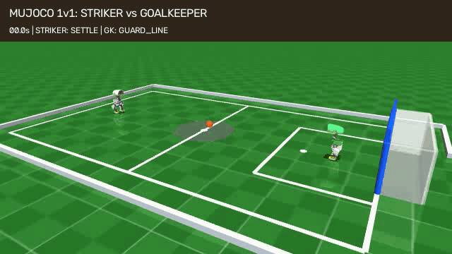
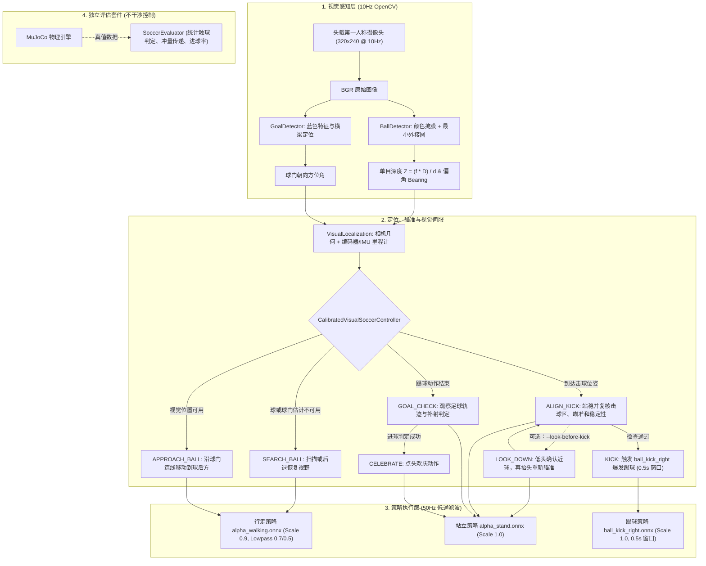

# 🦆 Microduck Vision Soccer — MuJoCo 自主机器人足球 ⚽

面向 Pollen Robotics Microduck 的自主机器人足球：先在 MuJoCo 中开发和验证视觉闭环，再通过官方 `mediad` 相机接口与 `robotd` 控制接口迁移到真机。最新仿真版本支持一只视觉进攻鸭对阵一只单目视觉守门鸭。

<p align="center">
  <a href="README.md"><b>English</b></a> · <a href="README_zh.md"><b>中文</b></a>
</p>

<p align="center">
  
  <br><sub>严格视觉进攻：识别 → 接近 → 瞄准 → 物理踢球 → 进门</sub>
</p>

<p align="center">
  <b>100 次中进球 98 次 · 踢腿触球且进球 96 次 · 跌倒 0 次</b><br>
  <sub>冻结参数后的 MuJoCo 仿真真值导航基线，种子 100–199。上方 GIF 使用相机视觉控制，两类结果分别报告。</sub>
</p>

```bash
pip install -r requirements.txt
python sim_duck_soccer.py --mode strict
python benchmark.py --trials 10 --seed 0
```

严格模式只用头部 RGB 相机、IMU 和关节编码器做控制；仿真世界坐标只供独立评估。踢球由随仓库提供的 ONNX 策略和 MuJoCo 真实接触完成，不瞬移足球，也不注入速度。仓库现在已经包含对接当前 Microduck `mediad -> media.frame` 相机链路和 `robotd` JSON-RPC 控制链路的机载运行脚本；完整真机足球行为仍需在实体 Microduck 上验证。

<p align="center">
  
  
  
  
  
</p>

> **当前状态：仿真已验证、真机接口已就绪的原型。** 机载相机/控制接入已按当前 Microduck 官方 IPC 接口实现，但完整足球行为尚未在实体硬件上验证。严格视觉模式的测试范围见 [VALIDATION.md](VALIDATION.md)，单独验证的 98/100 仿真真值基线见 [ORACLE_VALIDATION.md](ORACLE_VALIDATION.md)。

### 最新功能：视觉进攻鸭 vs 视觉守门鸭

<p align="center">
  
  <br><sub>MuJoCo 外部场地视角：物理接近、踢球、守门鸭触球并解围；不瞬移足球，也不注入速度。</sub>
  <br><br>
  
  <br><sub>双机载相机 HUD：进攻鸭在 8.44 秒射门，守门鸭视觉识别、拦截并将物理足球解围。</sub>
</p>

```bash
python sim_duck_soccer.py --mode strict --goalkeeper
python sim_duck_soccer.py --mode strict --goalkeeper --headless \
  --record-view field --record match.mp4 --duration 13
```


---

## 📖 定位与核心贡献 (Motivation & Value)

在官方开源的 [Microduck](https://github.com/pollen-robotics/microduck) 强化学习策略中，`ball_kick_right.onnx` 本身是**无视觉感知（Ball-blind）**的：训练时假设操作者或上层已将鸭子对准球，策略仅负责在站立姿态下执行踢腿动作。官方路线图也将全自主的“找球→走过去→对准→踢球”（Ball play）列为待实现的感知驱动行为。

虽然社区中已有如 `quackd`（主要为 2D 模拟器框架）和部分基于第三方板卡（如 RDK X5）的追球尝试，但 **Microduck Soccer** 专注于：**直接面向官方 Microduck 原生 MJCF 物理模型、传感器规范与 `robotd` 运行时的仿真优先严谨视觉伺服层**：

1. **严格纯视觉模式 (`--mode strict`)**：控制器**绝不读取**任何 MuJoCo 上帝视角真值（球的世界坐标与速度仅供外部评估；关节速度和 IMU 仍供底层策略使用），仅使用机载 RGB 广角相机画面和关节/IMU 本体感知。
2. **物理真实击球（拒绝瞬移作弊）**：小黄鸭通过自主视觉导航走到球前，尝试由右脚物理击打足球，踢球前**绝不使用任何坐标传送（Teleportation）**。
3. **单目尺度测距几何算法**：已知足球物理直径 $D = 70\text{ mm}$，利用小孔成像几何实时求解公制度量距离：
   $$Z \approx \frac{f \cdot D}{d}$$
   随着小黄鸭逼近足球，步速根据真实距离平滑收敛减速，降低接近阶段的速度；盲区内仍可能出现位置误差。
4. **对齐官方 `robotd` 控制链**：完整复刻了官方运动尺度（行走 0.9、踢球/站立 1.0）、一阶低通滤波（腿部 $\alpha=0.7$、头部 $\alpha=0.5$），并将射门时钟严格设定为官方标准的 **0.5 秒**。
5. **对接当前 Microduck 机载 IPC**：真机脚本 [`duck_soccer_onboard.py`](duck_soccer_onboard.py) 从 `/run/mediad/media.sock` 调用 `media.frame` 获取新鲜相机帧，将原始 UYVY 转成 BGR，并应用官方返回的 `rotate` 相机安装角；运动命令则通过 `/run/robotd.sock` 发送。连续速度使用 `vyaw`，离散踢球使用 `robot.do`。同时保留旧固件可用的 V4L2 相机路径。

---

## 🏗️ 系统架构图 (Architecture)



---

## 🎯 状态机详细规范 (FSM Details)

默认严格控制器先把球与球门像素转换为局部公制位置，再通过关节编码器/IMU 的短程里程计，在足球进入相机近场盲区后延续位置估计。控制器把右脚送到标定后的击球位姿，并根据实测“球→球门”连线主动瞄准。还可以选择在踢球前低头，用视觉再次确认静止近球：

| 状态 (State) | 感知输入条件 | 运动控制逻辑 | 转移条件 |
| :--- | :--- | :--- | :--- |
| **`SEARCH_BALL`** | 球或球门估计缺失/过期 | 原地扫描；若记忆中的球太近而不可见，则后退恢复视野 | 获得新鲜的球和球门估计 |
| **`APPROACH_BALL`** | 相机估计的球/球门位置与编码器/IMU 里程计 | 先绕到球后方，再走向标定的右脚击球位姿，并把预测出球方向对准球门 | 到达目标位姿，或预测脚部间隙正在快速收敛 |
| **`ALIGN_KICK`** | 到达击球位姿 | 切入 `alpha_stand`，复核球是否在击球区、射门角余量、机体稳定性及球速 | 所有踢球条件通过 |
| **`LOOK_DOWN`** *（可选）* | 启用 `--look-before-kick` 且踢球条件通过 | 低头采集一致的近球图像样本，抬头后重新进行定位与瞄准检查 | 确认足球；若超时则不踢 |
| **`KICK`** | 击球区、瞄准、稳定性与球速检查全部通过 | 切换为 `ball_kick_right.onnx` 执行爆发式单腿踢球（精准 0.5 秒） | 踢球动作窗口结束 |
| **`GOAL_CHECK`** | 踢球动作完成 | 切回站立姿态，观察足球滚动轨迹 | strict 模式等待后重新搜球；进球真值只用于统计 |
| **`CELEBRATE`** | 仅 demo 模式允许评估器触发 | 屏幕弹出金色横幅，头部有节奏地点头欢庆 | 庆祝计时器归零，重置状态 |

---

## 🚀 仿真快速上手 (Simulation Quickstart)

### 1. 环境准备
```bash
git clone https://github.com/toyhank/microduck-vision-soccer.git
cd microduck-vision-soccer
pip install -r requirements.txt
```

### 2. 启动 3D 足球仿真
```bash
# 严格纯视觉模式 (默认: 100% 视觉控制，物理踢球，无作弊)
python sim_duck_soccer.py --mode strict

# 1对1对战模式：自主纯视觉守门鸭 (身穿翡翠绿球衣，机载 10Hz 单目视觉 + 弹道预测拦截，开启双屏 HUD)
python sim_duck_soccer.py --mode strict --goalkeeper

# 录制 1v1 高清双机载视觉 HUD 至 MP4（1280x480，默认录制视角）
python sim_duck_soccer.py --mode strict --goalkeeper --record match.mp4 --duration 12

# 录制 MuJoCo 外部场地视角（640x360）
python sim_duck_soccer.py --mode strict --goalkeeper --headless --record-view field --record field.mp4 --duration 13

# 守门员真值对照模式 (Oracle 基线)
python sim_duck_soccer.py --mode strict --goalkeeper --gk-mode oracle

# 可选参数：无头高速运行、限制仿真秒数
python sim_duck_soccer.py --headless --duration 12

# 演示模式 (允许真值对齐辅助，便于调试)
python sim_duck_soccer.py --mode demo
```

### 3. 运行自动化 Benchmark 基准评测
运行批量随机测试（随机球坐标与鸭子初始偏角），生成量化表现报告：
```bash
python benchmark.py --trials 10
```

使用固定种子保存每次试验结果：
```bash
python benchmark.py --trials 10 --seed 0 --output results.json
python -m unittest discover -s tests -v
```
`kick_contact` 只统计踢腿策略期间真实的右脚—球接触；走路碰球单列为 `foot_contact`。距离接近和球速变化不再算作触球。进入终末接近状态不代表成功到达击球位置。


---

## 仿真真值导航基线（Oracle）

`oracle_soccer.py` 读取仿真中的机器人/球位置、球速和脚球间隙，先走到球后方，站稳后补偿出球偏角，再调用现有右脚踢球策略。机器人和球只在开局初始化一次，之后依靠关节控制和 MuJoCo 碰撞运动。此模式不使用相机，不能直接部署到真机。

```bash
# 打开仿真窗口，观察完整接近和射门过程
python oracle_soccer.py --viewer --seed 100
# 无需渲染器的批量测试
python oracle_soccer.py --seed 100 --trials 100 --duration 40 --workers 4 --output oracle-results.json
```

冻结控制参数后，独立种子 100–199 实测：**进球 98/100，有踢腿触球且进球 96/100，跌倒 0/100**。其中 2 次为走路推球进门，没有踢腿触球。这只覆盖指定的初始位置范围，不代表严格视觉模式的成功率。测试条件和失败样本见 [ORACLE_VALIDATION.md](ORACLE_VALIDATION.md)，逐次结果见 [JSON](validation/oracle-seeds-100-199.json)。

## 🤖 真机单机运行 (Real Robot Onboard Deployment)

脚本 [`duck_soccer_onboard.py`](duck_soccer_onboard.py) 直接运行在 Microduck 的 Rockchip RK3566 Linux 主板上，并遵循当前官方守护进程分工：`mediad` 独占相机，`robotd` 独占电机和运动安全。

### 1. 真机数据链路

```text
头部相机
   ↓
mediad
   ↓  /run/mediad/media.sock
media.frame（JSON 头 + 原始 UYVY 数据）
   ↓
UYVY → BGR → 应用 rotate → 缩放
   ↓
BallDetector / GoalDetector
   ↓
SoccerStateMachine
   ↓
/run/robotd.sock
   ↓
robot.move / robot.do(kick_right)
```

- **首选相机接口**：`/run/mediad/media.sock`，方法 `media.frame`。
- **图像处理**：校验尺寸和字节数，将 packed UYVY 转成 BGR，根据 `rotate` 修正方向，再保持宽高比缩小。
- **旧接口回退**：旧固件或明确停止 `mediad` 时，可用 `--camera-source v4l2` 直接通过 OpenCV/V4L2 取图。
- **运动安全边界**：Python 不直接写任何舵机，只向 `robotd` 发送高层运动 intent。
- **不读取仿真真值**：真机路径只消费图像检测结果和单调时钟，不读取 MuJoCo 世界坐标。

### 2. 先检查真机相机接口

当前 Microduck 固件可先运行：

```bash
robotctl version
robotctl health
ls -l /run/mediad/media.sock
robotctl frame --output /tmp/frame.uyvy
```

`robotctl frame` 会把捕获尺寸与相机安装旋转角输出到 stderr。若 `media.frame` 不可用，应先升级机器人 daemon，或显式使用旧版 V4L2 路径。

### 3. 部署与运行

```bash
# 传输脚本和 Python 包到小黄鸭
scp -r duck_soccer_onboard.py microduck_soccer radxa@<小黄鸭IP>:~/

ssh radxa@<小黄鸭IP>

# 默认：检测到 mediad socket 时自动使用官方相机接口
python3 duck_soccer_onboard.py --camera-source auto

# 强制使用当前官方 mediad 接口
python3 duck_soccer_onboard.py --camera-source mediad

# 仅供旧固件 / 主动停止 mediad 的场景
python3 duck_soccer_onboard.py --camera-source v4l2
```

可用参数：

```text
--media-socket PATH      覆盖 /run/mediad/media.sock
--v4l2-device N          旧版 OpenCV 相机编号
--loop-sleep SECONDS     控制循环最小休眠时间
```

> **真机仍需要标定。** HSV 阈值、相机 FOV、基于球直径的单目测距，以及最终盲区前进时间均来自仿真，应在实体 Microduck 上重新标定后再进行自主踢球。

---

## 📂 项目结构 (Repository Structure)

```text
microduck-vision-soccer/
├── sim_duck_soccer.py        # ⚽ 仿真主程序 (--mode strict / demo)
├── benchmark.py              # 🏁 自动化基准测试套件
├── duck_soccer_onboard.py    # 🤖 mediad 相机 + robotd 真机运行程序
├── oracle_soccer.py          # 🎯 仿真真值导航对比基线
├── requirements.txt          # 📦 Python 依赖列表
├── LICENSE                   # 📄 Apache-2.0 开源许可
├── NOTICE                    # 📄 版权声明与上游归属
├── README.md                 # 📖 英文说明文档
├── README_zh.md              # 📖 中文说明文档
│
├── assets/                   # 🏟️ 彻底解耦的仿真与策略资产库
│   ├── scene_soccer.xml      # MuJoCo 足球场仿真场景定义 (单鸭模式)
│   ├── scene_soccer_goalkeeper.xml # 双鸭对战场景 (进攻鸭 + 守门鸭)
│   ├── robot_allcollisions.xml # 进攻鸭机器人本体结构与碰撞体
│   ├── robot_goalkeeper.xml  # 守门鸭机器人定义 (翡翠绿战袍涂装)
│   ├── meshes/               # 94 个 STL/part 3D 几何网格
│   └── policies/             # 独立的 ONNX 运控模型（行走、踢球、站立）
│
├── microduck_soccer/         # 📦 核心算法包
│   ├── assets.py             # 资产路径自动解析与管理
│   ├── perception/           # 单目测距与球门检测
│   ├── control/              # 视觉伺服、严格状态机与守门员控制器
│   ├── policy/               # 对齐官方 robotd 参数的策略推理器
│   └── evaluation/           # 独立基准评估器 (进球与扑救统计)
│
├── tests/                    # 🧪 单元回归测试集
└── validation/               # 📊 验证基准测试报告与数据
```

---

## 🤝 致谢与上游声明 (Acknowledgments)

- 本项目基于 **[Pollen Robotics](https://pollen-robotics.com) / [Hugging Face](https://huggingface.co)** 开源的 Microduck 双足机器人平台构建。
- 启发自社区相关工作（包括 `quackd` 与 D-Robotics RDK X5）。
- 物理仿真由 **[DeepMind MuJoCo](https://mujoco.org/)** 提供强力驱动。
